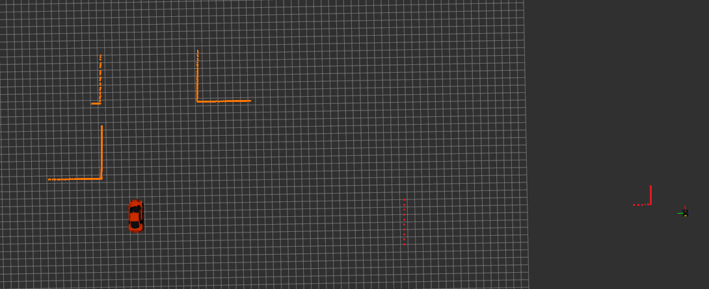
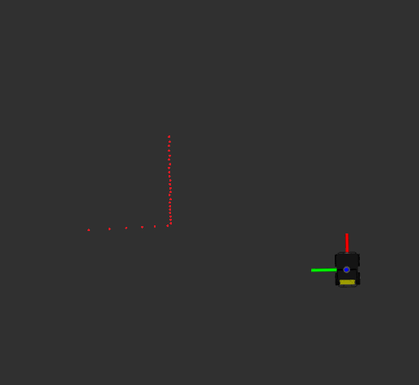

Quiz 4
======

Part A
------

**PREAMBLE**

This quiz reinforces the following concepts: (1) Constructors and class design (2) Overall control logic using threading (3) Using laser data and (4) Goal-reaching behaviour with obstacle awareness.

We provide scaffolding for the `Controller` and `Skidsteer` classes, as used in Assignment 2. As in the assessment, functionality must be implemented across the base class `Controller` and the derived class `Skidsteer`. The code will not compile until the required functions are implemented. You may reuse sections of your Assignment 2 implementation for this quiz. The only interface difference from the Assignment 2 skeleton is the additional function `getObstacles` in `ControllerInterface`, which is specific to this quiz.

Starting Options

1. Start from the provided quiz code, or
2. Copy your Assignment 2 implementation (`Controller` and `Skidsteer` files `controller.h` `controller.cpp` `skidsteer.h` `skidsteer.cpp`) into this quiz folder.

If you copy your Assignment 2 code, you should retain the following quiz-specific elements which are required for the quiz and differ from the standard a2_skeleton. 

- The class member `srd::shared_ptr<LaserProcessing> laserProcessingPtr_` and it's initalisation in the Constructor.
- The function `std::vector<pfms::geometry_msgs::Point> Skidsteer::getObstacles(void)` with it's implementation.

**REQUIREMENTS AND RUNNING TESTS**

The quiz has been developed against **pfms2ros** debian package ( version 3.1.1 or above ).  You will receive an error if you do not have this version and can upgrade via:

```
sudo apt update
sudo apt install pfms-ros-integration ros-humble-pfms ros-humble-audibot-gazebo ros-humble-audibot
```

Before running the unit tests make sure you have run the simulator `ros2 launch pfms a2.launch.py`. 

We have been provided some tests to let us debug, isolate, fix issues and create the `Skidsteer` class. The unit tests are in [`utest.cpp` in ./a/test folder](./a/test/utest.cpp) and they can be run from build directory via `./test/utest` and you can also find them in vscode (select `utest` to run).  There are three tests provided in the `SkidsteerTest` suite (to further assist A2 development) and one will be provided subsequently in marking.  

**TASK 1 - Initialisation of class**

All member variables belonging to the class need to be initialised to default values. When we have a base and derived class the initialisation can occur in either the [Base Class Constructor (Controller)](./a/controller.cpp)  or the [Derived Class Constructor (Skidsteer)](./a/skidsteer.cpp) .  Initialise the variables in the appropriate constructor so that the `Constructor` tests pass. 

We also need to check that all function in the interface return values as specified, and they can operate even if no goals are yet set (the constructor does not take goals, therefore any function can be called when the object of the class is created.) 

HINT: Check what is being tested in `SkidsteerTest, Constructor` test, look where the variables exist and consider where they should be initialised. Consider that you would also have another derived class `Ackerman` in Assignment 2.  

**TASK 2 - Checking obstacles**

The quad copter is equipped with a laser scanner, which allows it to detect obstacles (unlike Assessment 2 where this needs to be in mission class). We have supplied the `LaserProcessing` class, and have initialised it in the constructor of `Skidsteer`. The role of the `LaserProcessing` class is to detect the centre of a obstacle present in the laser scan.  For simplicity, in this quiz there is only one obstacles present in the laser scan up to 15m. However this is a square, and therfore you will need to approximate it's centre using the valid laser readings (range vector). A reading is valid if it is reported as being in between the minimum and maximum range (15m). For details of using laser data refer to `a1_snippets` example, where we obtained and examine laser data. Implement the `getObstacles` function of `Skidsteer` class, which return the centre of the obstacle in the world coordinates. We examined local to global conversion in Quiz3 and it would be very useful here. So to do this task you will need to call `laserProcessingPtr_->getObstacles` and use the platform odometry to the to world (global) coordinates. 

The obstacle is far away from the the maze (left the entire world, right the zoomed in view of the object)


<div style="display: flex; gap: 20px;">
  
  
</div>
**TASK 3 - Overall logic**

Examine `SkidsteerTest, StartingLogic` which shows the overall functionality expected from Platforms in Assignment 2 in commencing execution. The platform will start in IDLE until goals are set (via `setGoals`) AND `run` is called. At which point the status changes to `RUNNING` and the platform commences motion. As the `run` call is non blocking, it should return immediately.  Consider that `run` kicks off execution by starting/triggering another thread, as the control needs to monitor the platform position and control it to reach one goal at a time (supplied via `setGoals`).

The function  [reachGoal in Skidsteer](./a/skidsteer.cpp) is private, and could be used to control the platform. You will need to consider how this function will be called to execute (HINT, think threading and mutex/convars). 

The test here emphasises that the state reported is correct, that run is not blocking, the platform commences motion by changing state and moving.

 **TASK 4 - Checking obstacles after reaching last goal** (hidden test)

This test builds upon the checking obstacle logic of TASK 3. However, here we need the full control logic of Assessment 2 and `getObstacles` is called after the last goal is reached. 

For the full control logic, consider how to control the platform towards the goals(s). Here we need to use the orientation of the platform and the direction we need to head towards, we recommend rotating the platform on the spot and then control simultaneously forward/backward and turn left/right. 

In the code provided here, the `reachGoal` will terminate as it does not have any control logic, I would suggest to implement it and think about how it will commence and run as a thread.

Part B
-------

To undertake testing and developing your code you only need to add symbolically link quiz4 part b to your ros2_ws. 

For instance my git is ~/git/pfms-2026a-alalemp (change for your location of your git) and therefore only once do i need to complete below.

```bash
cd ~/ros2_ws/src
ln -s ~/git/pfms-2026a-alalemp/quizzes/quiz4/b 
```

Open up the code by opening the `ros2_ws` folder in vscode. You should be able to see a `b` folder. If it is in red you have not linked correct folder path. We need to implement a single function in  [analysis](./b/src/analysis.h) class.

When you need to compile your code you need to be in folder `~/ros2_ws/`and compile via a`colcon` command, you need to execute the command every time you change the code and want to execute the code with the changes. This can not be done via vscode.

You can either build all packages in `ros2_ws` via `colcon build --symlink-install` or you can specify a single package `colcon build --symlink-install --packages-select quiz4_b`for instance.

To check the unit test, in the terminal you run

```bash
ros2 run quiz4_b utest
```

**TASK 5 - Count characters**

Counts the number of characters (including spaces, special characters and numbers) in the string supplied: for instance "foo boo 12" has 9 characters. 

